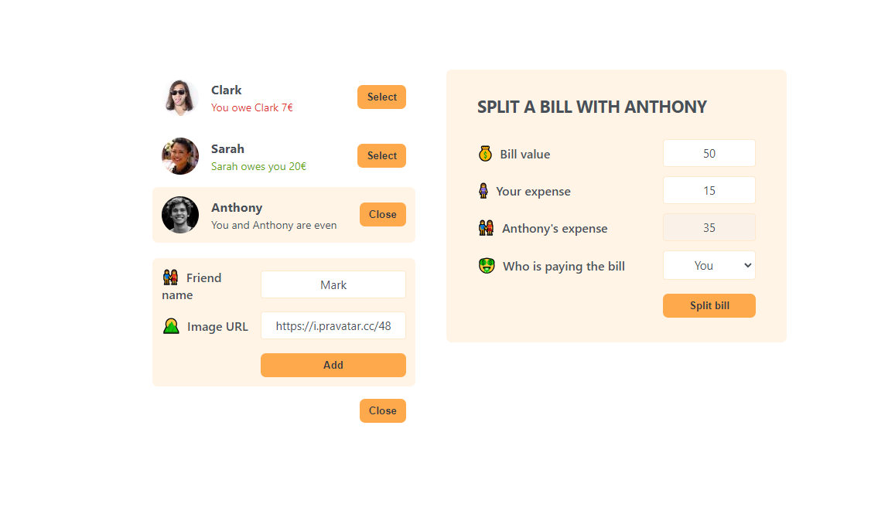

<div id="top"></div>


<!-- PROJECT LOGO --> <br /> <div align="center"> <a href="#">  </a> <h1 align="center">Bill Split App</h1> <p align="center"> A simple and efficient React app to split bills among friends or groups. <br /> <a href="https://main--eatnsplitproject.netlify.app/">View Demo</a> </p> </div> <!-- TABLE OF CONTENTS --> <details> <summary>Table of Contents</summary> <ol> <li> <a href="#about-the-project">About The Project</a> <ul> <li><a href="#features">Features</a></li> <li><a href="#built-with">Built With</a></li> </ul> </li> <li> <a href="#getting-started">Getting Started</a> <ul> <li><a href="#installation">Installation</a></li> <li><a href="#tree-structure">Tree Structure</a></li> </ul> </li></ol> </details> <!-- ABOUT THE PROJECT -->
<h2>About The Project</h2>

The Bill Split App is a React application designed to make it easy to split bills among multiple people. Whether it's for a group dinner, a trip, or a shared expense, the app calculates how much each person owes based on their contribution and helps settle up the payments.

<h2>Features</h2>

Add participants and their respective expenses.
Calculate how much each person owes.
Decide who pays the bill.
Simple, intuitive UI for a seamless user experience.

Built With
[
React ,
TypeScript ,
CSS3 ,
Node.js
]



<p align="right">(<a href="#top">back to top</a>)</p>
<!-- GETTING STARTED -->
<h2>Getting Started</h2>

To get a local copy up and running, follow these steps.

Clone the repo

```sh
git clone https://github.com/Maid-Type/EatNSplit.git
```

Go to project folder

```sh
cd EatNSplit
```

Install dependencies

```sh
npm install
```

Run the development server

```sh
npm start
```
Tree Structure

```sh
EatNSplit
│   .gitignore
│   package-lock.json
│   package.json
│   README.md
├───src
│    ├───App.js
│    ├───index.css
│    └───index.js
└───public
     ├───favicon.ico
     ├───index.html
     ├───logo192.png
     ├───logo512.png
     ├───manifest.json
     └───robots.txt

calculations.ts
```

<p align="right">(<a href="#top">back to top</a>)</p>
